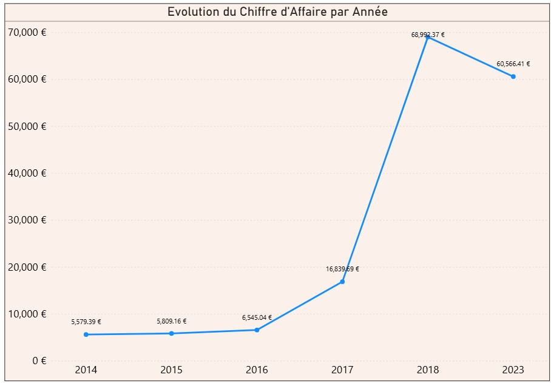
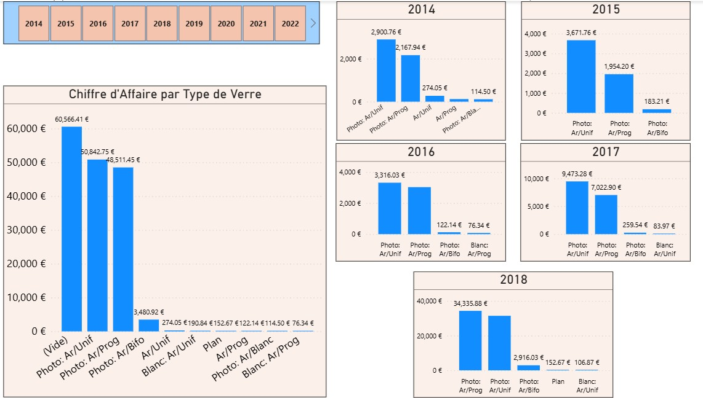
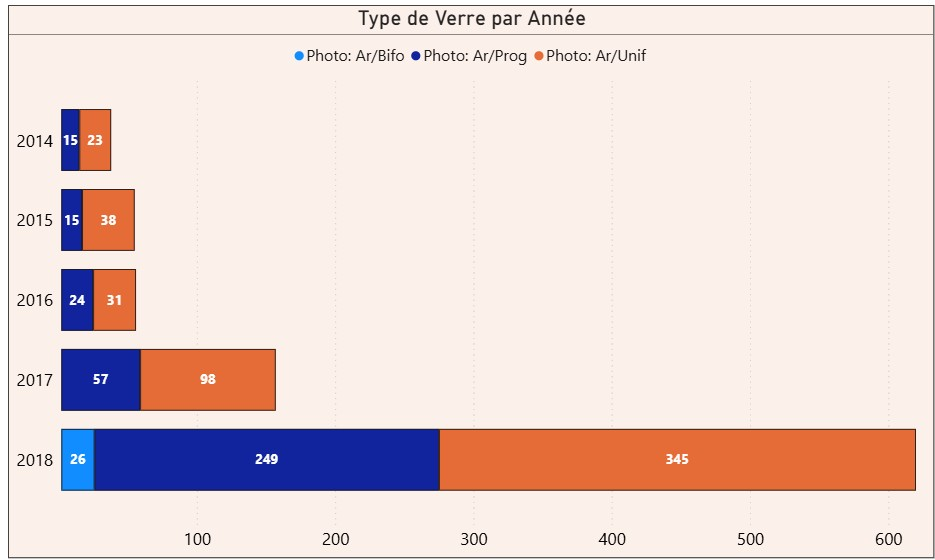
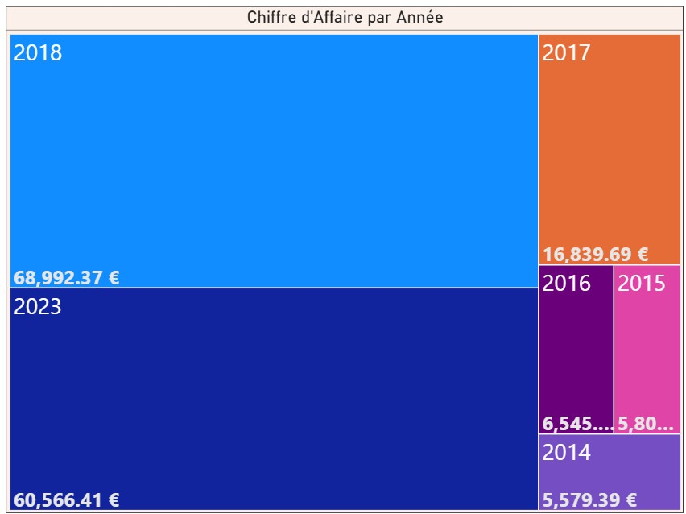

# Power BI Sales & Inventory Insights Dashboard

This repository presents a complete data analytics project designed for a retail business (optical products), using **Power BI**, **Azure SQL**, and **ETL techniques** to visualize and optimize business performance.

## 🔍 Project Overview

The goal was to automate sales reporting, understand product trends, and support data-driven decisions using a dynamic Power BI dashboard.

### 🧩 Key Components

- 📌 **ETL Pipeline**: Cleaned and transformed sales data from multiple sources (CRM, Excel, SQL)
- 📊 **Dashboards**:
  - Annual Revenue Trend (Line Chart)
  - Revenue Breakdown by Lens Type (Bar Charts)
  - Product Distribution by Year (Stacked Bar)
  - Revenue Distribution (Treemap)
- ☁️ **Cloud Integration**: Azure SQL Database as data source
- 🔄 **Automation**: Data refresh scheduled weekly

## 📸 Dashboard Snapshots

| Visual | Description |
|--------|-------------|
|  | 📈 Annual sales trend over 10 years |
|  | 📊 Revenue by product type with yearly focus |
|  | 📦 Product category distribution over time |
|  | 🔲 Revenue treemap by year |

## 📁 Sample Dataset

A mock CSV dataset is provided in `data_sample/` to demonstrate data structure.

## 🛠️ Tools & Technologies

- Power BI (Desktop)
- Azure SQL Database
- Power Query (M)
- DAX
- Excel
- Python (ETL prototype)

## 📈 Business Impact

- 📈 **+23% Sales**: Through better visibility of top-performing products
- 📉 **-17% Storage Costs**: By optimizing stock based on historical trends
- ⚡ Real-time KPIs enabled via automated data pipelines

## 📜 License

This repository is under the MIT License.  
Data shown here is anonymized or simulated for portfolio purposes.
